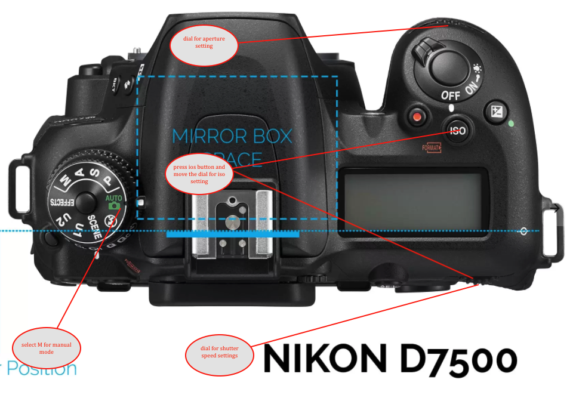

# photography

---
## iso
```
 how much sensitive camera sensor will be for light ,higher the iso more brighter and 
 less sensitive the picture and more noise so it must be always low which give rich color for day and hight for the night time 
```
## aperture 
```
 how wide lense will open area for taking the shot, apature which will be set from F number low the number lense will open more 
 wide if more lower then dept of picture will be more higher the number dept will be more and lower the nubmer shot will be shallow 
 the like (blur background and sugject will be clear only )
 ```
## shutter speed 
```
 speed on the shutter to grab the shot  show the sutter speed it will be blure with tale fast the shutter speed more accurate pic 
```

## NOTES
* higher the shutter speed lower the apature 
	* shutter will open and close fast then we need wide open lense to take more light using aptature 
* lower the shutter spped and lower the apature for the dark picture 
* take help of light exposer meter for know the under expose or over expose shots 





## Focal length 
* how much angle can lense cover while taking picture 
